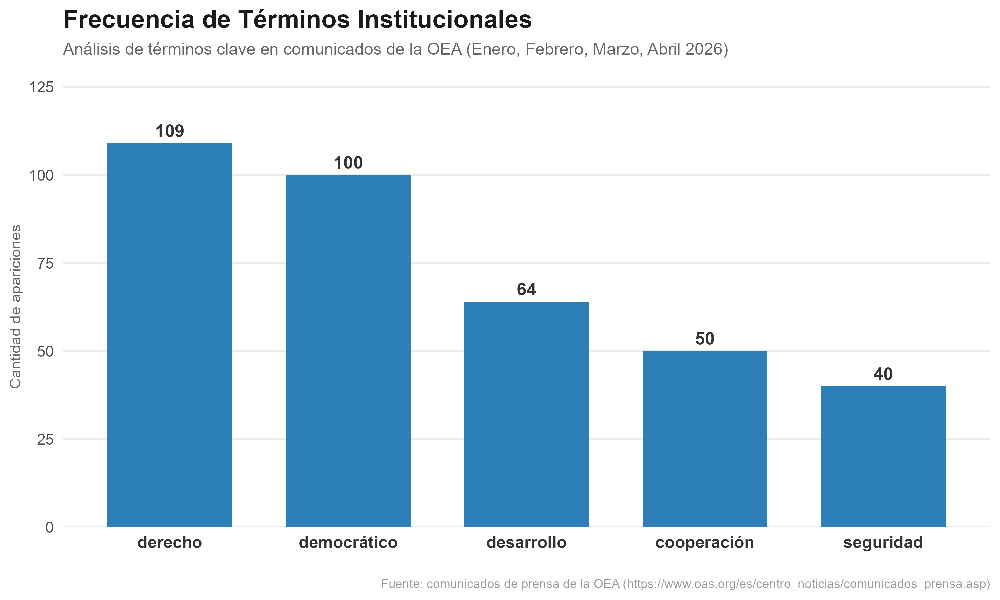
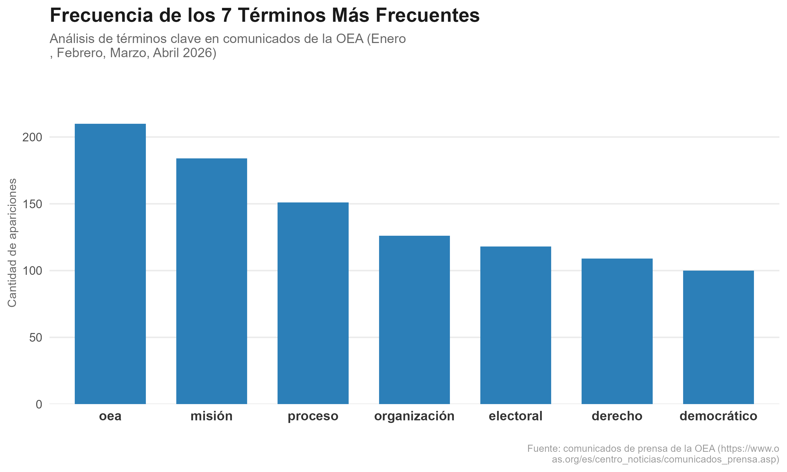

## Objetivo del trabajo

El objetivo de este trabajo es aplicar herramientas de **web *scraping*** y **procesamiento de lenguaje natural** sobre los comunicados de prensa de la **Organización de los Estados Americanos (OEA)** correspondientes al primer cuatrimestre de 2026.

Acorde al sitio oficial, este organismo tiene como misión promover la democracia, los derechos humanos, la seguridad y el desarrollo en la región. Por lo tanto, el siguiente análisis busca cuantificar la presencia de tópicos institucionales clave mediante la frecuencia de dichos términos en el corpus recolectado.

## Estructura del proyecto

El proyecto tiene una estructura modular, en la cual hay tres *scipts* principales que secuencialmente se encargan de diferentes partes del análisis.

- `scripts/scraping_oea.R`: este *script* tiene como propósito principal realizar el proceso de *scraping* de los comunicados de prensa de la OEA, extrayendo la información relevante y almacenándola en un formato estructurado para su posterior análisis. El mismo guarda en la carpeta `data` los *htmls* de cada comunicado y un `tibble` titulado `comunicados_prensa_2026.rds` con tres variables: **id**, **titulo** y **cuerpo**.

- `scripts/processing.R`: este *script* se encarga de procesar los datos obtenidos del *scraping*, realizando tareas como limpieza de texto, lematización, eliminación de palabras vacías (*stop words*), y cualquier otra transformación necesaria para preparar los datos para el análisis posterior. El resultado de este procesamiento se guarda en un nuevo `tibble` en formato *long* titulado `processed_text.rds` con las variables **id, titulo, lemma.**

- `scripts/metric_figures.R`: por último, este *script* se dedica a calcular métricas relevantes (la matriz *DTM*) y generar figuras que permitan visualizar los resultados del análisis.

Es importante tener en cuenta que los *scripts* están diseñados para correrse en el siguiente orden.

```{r}
#| warnings = FALSE
library(here)

source(here("TP2", "scripts", "scraping_oea.R"))
source(here("TP2", "scripts", "processing.R"))
source(here("TP2", "scripts", "metrics_figures.R"))
```

## Análisis de los resultados

Con el fin de estudiar la concordancia de los comunicados oficiales de los últimos meses (Enero, Febrero, Abril y Marzo del 2026) con la misión original de la OEA se computó la matriz DTM (*Doc-Term Frequency Matrix*) y se limitaron sus entradas a cinco términos que se consideran relevantes: "derecho", "desarrollo", "seguridad", "democracia", "cooperar".

El corpus recolectado cuenta con un total de 74 comunicados con un valor mediano de 183 palabras (mínimo 54 y máximo 900, luego de filtrar comunicados con valores menores a 20) y 2437 caracteres (mínimo 60 y máximo 12837).

{fig-align="center"}

Los resultados de la Figura 1 muestran que efectivamente las palabras más representativas de la misión aparecen con alta frecuencia. Para verificar si dichas frecuencias representan valores considerables se graficaron, además, los siete términos más frecuentes.

Los resultados muestran que al menos los términos "derecho" y "democrático" son importantes dado que también son, respectivamente, la sexta y séptima palabra más frecuente. Asimismo, se observa que si bien las últimas palabras no están entre las más frecuentes sí aparecen otras asociadas con la misión.

{fig-align="center"}
